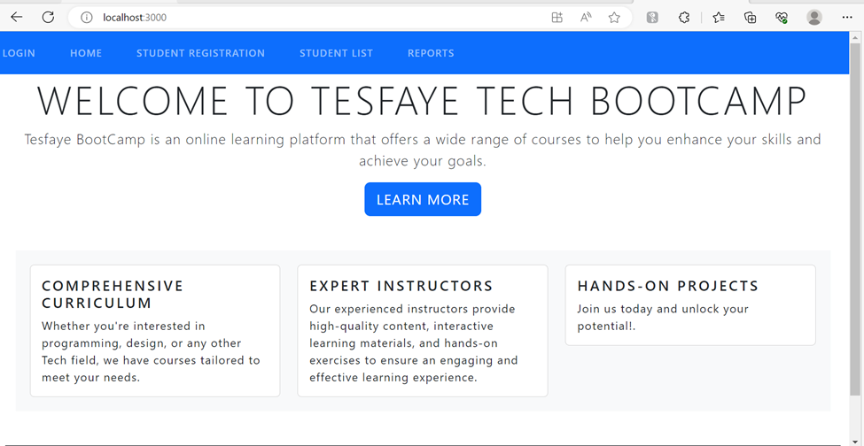

https://github.com/Tesfaye-Hailu/Mod3Project.git
https://dashboard.render.com/web/srv-cinitedph6ei90evfjtg/deploys/dep-cinitetph6ei90evfkb0

Project Title: Student Registration System
Introduction: This full-stacked project is named Student registration system using MERN Stack - Mongodb, Express, React, Node.js).
The App is taking Students name. There is a dropdown arrow for lists of departments and the user should select the departments from the dropdown arrow. For each department, there is a corresponding course attached and hence after selecting the department, the user will select again the course to be taken. Once we click the Registered button, the name, department and course will be displayed in the browser and at the same time it will be recorded in MongoDB.
Client side ( front end).
There is a home page with some messages & footer. If a user clicks “Learn More”, it will expand, and detailed information will be found.
In Student List page, we can find the list of registered students for all departments. Under each name there is a DELETE & UPDATE button. If we want to delete the record, we can click the delete button and the record will be removed both from the database and the browser.
If there is a need to modify or update a record, we can update the record. Name is editable in this page and department and course will be selected from dropdown arrow.
When we click SAVE button after clicking update and do some modifications, the modified records will be displayed in the browser and saved in the database.
In case if we want to cancel what we have done, but before clicking SAVE button, we can cancel the transaction.
The website has Report pages. Hence, the user can generate different reports like (name lists of students registered for a given department, name lists of students registered for a given course, name lists of a department, name lists of courses to be given at each departments).
Thus, the APP is capable of handling CURD [ Create- the registration task, Update, Read (Student List display) and Delete.
Backend
This project has used three models namely (students, courses and instructors). Its schema has been defined in the models. It has also its respective controllers.
Contact
Github link: https://github.com/Tesfaye-Hailu/Mod3Project.git
Deployment link in Render: https://dashboard.render.com/web/srv-cinitedph6ei90evfjtg/deploys/dep-cinitetph6ei90evfkb0
Built with
The application is built with (MERN): MongoDB, Express REACT JS, Node js, Java Script, Bootstrap & CSS.
Acknowledgement
I would like to thank and appreciate my instructor Mr Chase VH for his continuous guidance, encouragement, and help in all aspects of the entire program. Thank you, Chase! for everything.
Installation – the below application needs to run the program.
 To Clone, use the command <git clone https://github.com/Tesfaye-Hailu/Mod3Project.git> in the terminal.
 Visual Studio
 Google Chrome
 Node.js https://nodejs.org
 npm install-react-App (folder name) – it is a JavaScript library for building user interfaces.
 npm install axios – it is a popular HTTP client library for making asynchronous request from a web browser or Node.js.
 npm install bootstrap - popular CSS Framework for developing responsive and mobile-first websites.
 Npm install bootswatch – a library that provides free themes for Bootstrap which is also a popular CSS framework.
 npm install react-router-dom – it is a routing library for react applications, enabling declarative routing and navigation.
All the below dependencies should be installed using a command as <npm install **_> where _** is dependencies which are mentioned below.
 axios":
 "bootstrap":
 "bootswatch":
 "concurrently":
 "cors":
 "dotenv":
 "express":
 "font-awesome":
 "mongodb":
 "mongoose":
 "nodemon":
 "path":
 "react":
 "react-bootstrap":
 "react-dom": "
 "react-router-dom":
 "react-scripts"
 "web-vitals":

To be added features
• I have a plan to add more features in the log-in part. Now the login is not yet connected to the database and the server. It needs further enhancement to have authentication and different authority level.
• I will enhance to have more records about instructors.
• Records about Grade Report.
• More records of the student & instructors like Telephone, Age, email.

